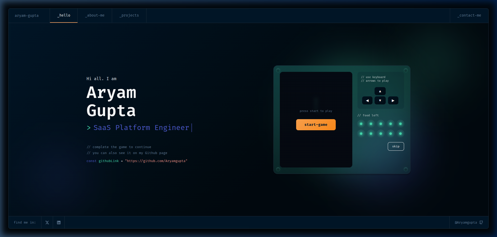
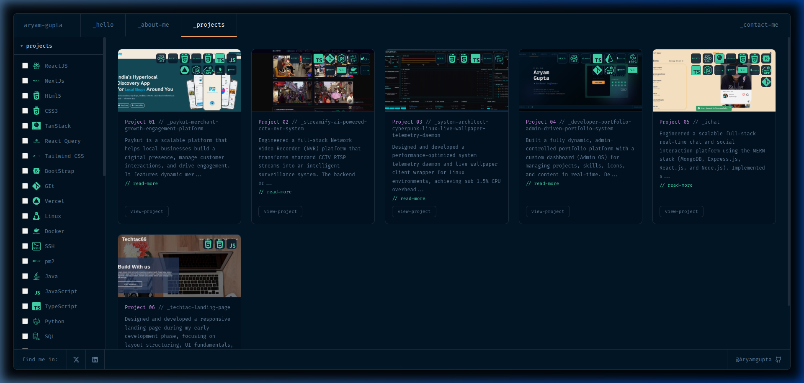
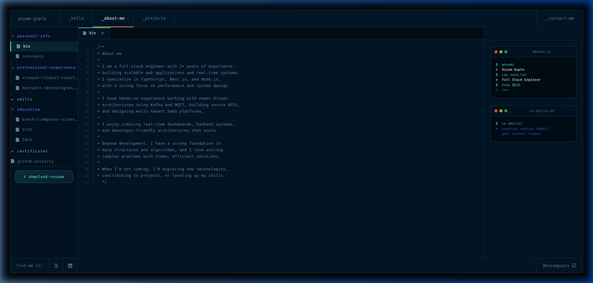
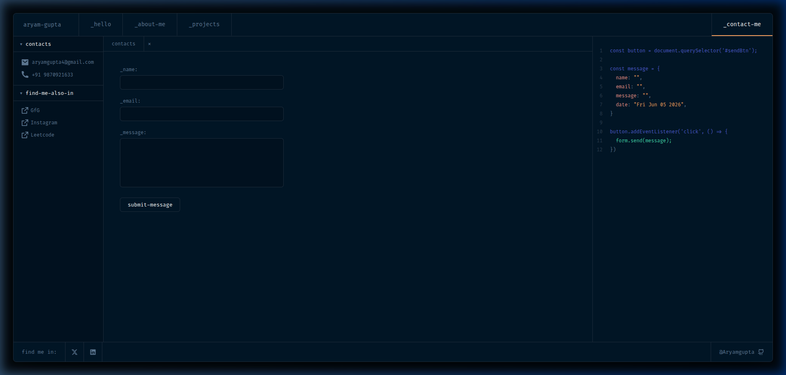
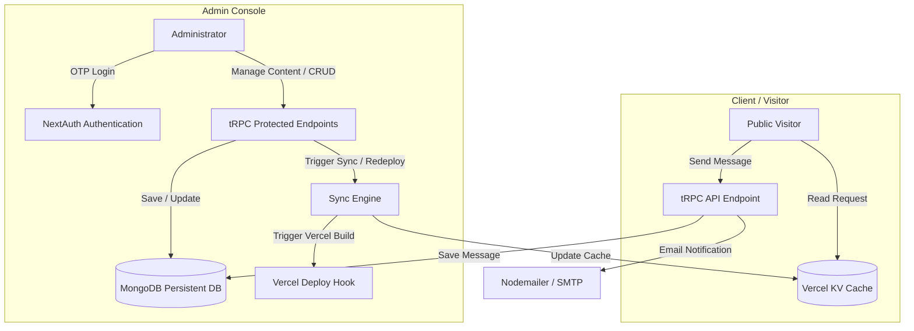

# ⌨️ Terminal & IDE-Themed Developer Portfolio

A high-performance, responsive developer portfolio designed to mimic an Integrated Development Environment (IDE) / Code Editor, complete with a terminal UI, code workspace, collapsible directory trees, and interactive games. 

Built with **Next.js 16 (App Router)**, **tRPC (v11)**, **Prisma**, **MongoDB**, **Vercel KV (Redis)**, and **Tailwind CSS v4**.

---

## 📸 Screenshots

### 💻 Home Page (Interactive Snake Game)


### 📁 Projects View (Dynamic Filter & Search)


### 👤 About Me


### ✉️ Contact & Console


---

## 🚀 Key Features

*   **🎨 Code Editor Workspace Layout:** Mimics VS Code/IDE with tab-based navigation (`_hello`, `_about-me`, `_projects`, `_contact-me`), line numbers, code-like typography, collapsible file tree sidebar, and syntax highlighting aesthetics.
*   **🐍 Interactive Snake Game:** Fully playable retro Snake Game integrated directly on the home page. Visitors can play using arrow keys/buttons, or skip it to unlock their path.
*   **⚡ Blazing-Fast Hybrid Architecture (MongoDB + Redis Cache):**
    *   **Reads:** Public pages fetch content directly from **Vercel KV (Redis)** for sub-millisecond data delivery, completely avoiding MongoDB latency.
    *   **Writes/CRUD:** The admin dashboard interacts with **MongoDB** via **Prisma** to manage all portfolio data. An on-demand sync mechanism pushes changes to Vercel KV.
*   **🔐 High-Security OTP-based Admin Panel:** Secure access using **NextAuth.js** with a customized **2-Factor Email OTP login flow** restricted to the administrator's email.
*   **📨 Real-Time Messages:** Contact form that records visitor messages in the database and triggers email notifications via **Nodemailer**.
*   **🛠️ Modular Admin Tools:** Complete administrative console featuring:
    *   Profile, Education, and Work Experience managers.
    *   Project manager (supporting tech stack associations and ordering).
    *   Dynamic SVG Custom Icon manager.
    *   Production redeploy trigger and modular cache-aside JSON synchronizer.

---

## 🧱 Tech Stack

| Layer | Technologies |
| :--- | :--- |
| **Framework** | Next.js 16 (App Router, Server Components), React 19 |
| **Styling** | Tailwind CSS v4, PostCSS, Framer Motion (Animations), Lucide Icons |
| **API Architecture** | tRPC v11 (End-to-end type-safe queries/mutations) |
| **Database ORM** | Prisma ORM & MongoDB Node Driver |
| **Primary Storage** | MongoDB Atlas (Persisted portfolio state) |
| **Caching / KV Store**| Vercel KV / Upstash Redis (Public read caching) |
| **Authentication** | NextAuth.js (JWT-based session management with custom OTP provider) |
| **Email Services** | Nodemailer (for sending admin OTP and message alerts) |

---

## ⚙️ Architecture Flow



---

## 🛠️ Installation & Local Setup

### 1. Prerequisites
Ensure you have the following installed:
*   [Node.js](https://nodejs.org/) (v18.x or above)
*   [npm](https://www.npmjs.com/) or [yarn](https://yarnpkg.com/) / [pnpm](https://pnpm.io/)
*   A running [MongoDB](https://www.mongodb.com/) Database (e.g., MongoDB Atlas)
*   A running [Upstash Redis](https://upstash.com/) or [Vercel KV](https://vercel.com/docs/storage/vercel-kv) instance

### 2. Clone and Install Dependencies
```bash
git clone https://github.com/Aryamgupta/terminal_portfolio.git
cd terminal_portfolio
npm install
```

### 3. Configure Environment Variables
Copy `.env.example` to `.env` and fill in your credentials:
```bash
cp .env.example .env
```

Review the values in `.env`:
*   `DATABASE_LINK`: Your MongoDB connection string.
*   `KV_URL` & `KV_REST_API_TOKEN`: Your Upstash Redis / Vercel KV details.
*   `EMAIL_SERVER_*`: SMTP settings for sending authentication OTP emails.
*   `NEXTAUTH_SECRET`: A secure random secret key.
*   `ADMIN_PIN`: Initial pin/passcode configuration.

### 4. Initialize Database Schemas
Generate the Prisma Client and push schemas to your MongoDB instance:
```bash
npx prisma generate
npx prisma db push
```

### 5. Start Development Server
```bash
npm run dev
```
Open [http://localhost:3000](http://localhost:3000) with your browser to view the application.

---

## 🔒 Administrative Login & OTP Flow

This project implements a passwordless, high-security email OTP authentication system:
1. Access the login screen at `/admin/login`.
2. The user enters their email (restricted by default to `aryamgupta4@gmail.com` in `lib/auth.ts`).
3. If the email matches, the backend generates a 6-digit verification code, stores it in MongoDB with a short expiry, and emails it using the configured SMTP server.
4. Input the received verification code at `/admin/verify-2fa` to authenticate your session.
5. Once authenticated, access the Dashboard at `/admin/dashboard` to sync data, trigger production redeploys, or edit details.

---

## 📄 License

This project is licensed under the MIT License. See [LICENSE](LICENSE) for more details.

---

Created by **[Aryam Gupta](https://aryam.info)**.
